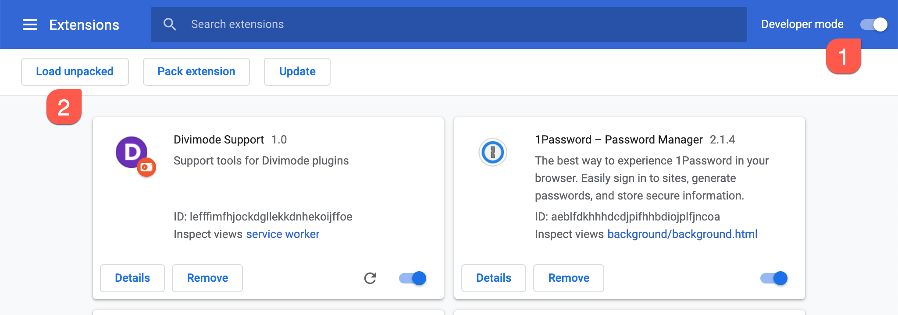

# Chrome Extension: Divimode Support

## Installation

1. Clone this repo to the local machine
2. Open the website `chrome://extensions/` in Chrome
3. Enable "Developer Mode" on the Extensions page
4. Click on the "Load unpacked" button
5. Select the local copy of the git repository, from step 1
6. Disable "Developer Mode" again

**Screenshots**

---

## Extension output

The extension will scan the current page for Divimode plugins and displays a basic overview of following details inside a small Popup:

* Theme and version (only detects "Divi" and "Extra" themes)
* jQuery version
* Popups for Divi active?
* Divi Areas Pro active?
* Is Popups for Divi / Divi Areas Pro up-to-date?
* Which Popups are present on the current page?

When jQuery, or Popups for Divi / Divi Areas Pro is outdated, a warning is displayed in the Popup.

**Screenshots**

Sample: Website that uses an outdated version of jQuery and old version of "Popups for Divi"   

Sample: Website that uses the latest version of "Divi Areas Pro", and has 1 Popup  

Sample: Website that uses the Extra theme, Divi Areas Pro and contains several Popups  

